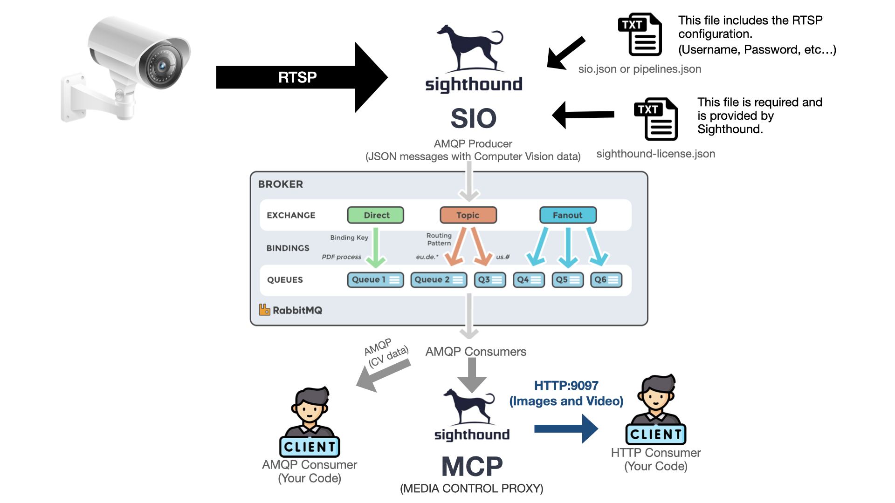
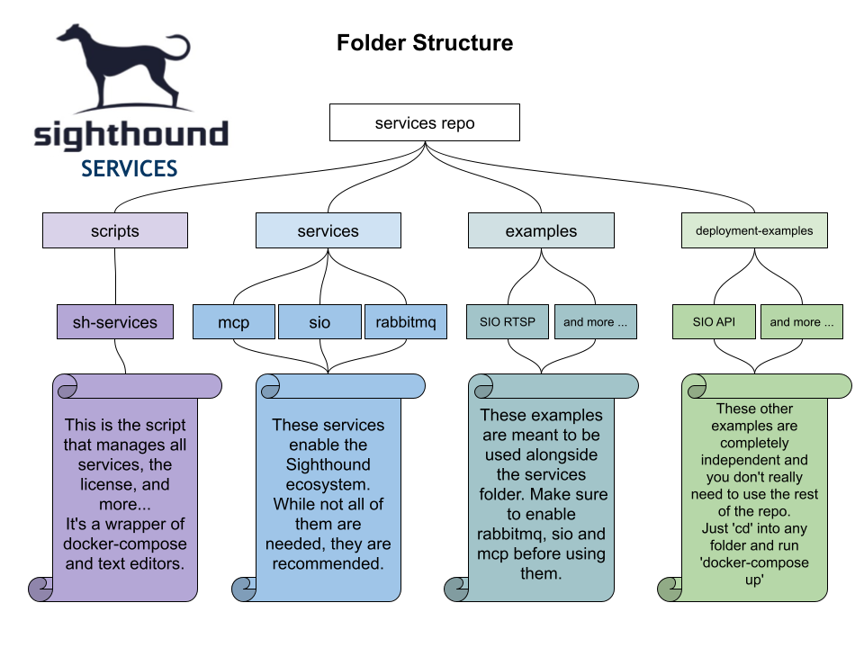
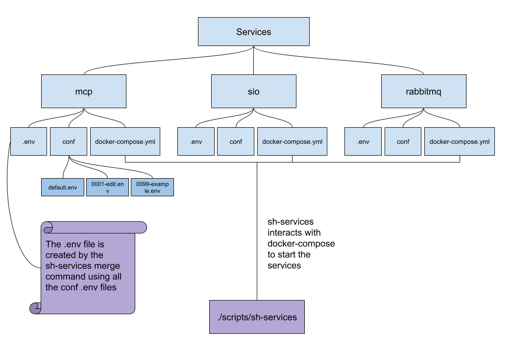
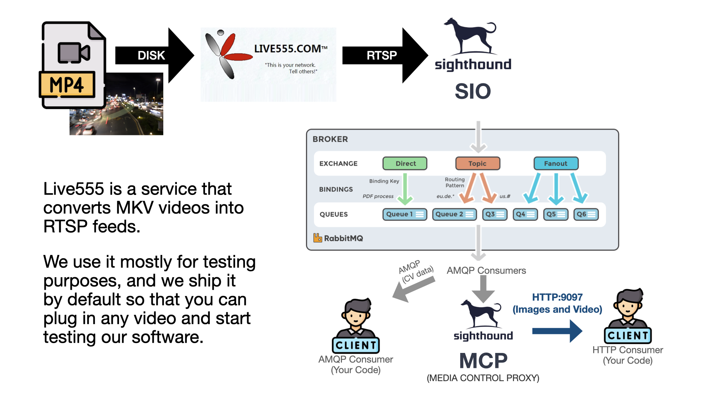

# Sighthound Services

This repository hosts a collection of services for the SIO (Sighthound.IO) ecosystem. Services are intended to run via the `./scripts/sh-services` script, which relies on docker-compose. However, docker-compose is not strictly necessary for configuring or using this repository.



The included services are as follow:
- SIO: The computer vision analytics engine.
- MCP: Media manager service, which includes a REST API and a cleaner. MCP relies on sharing media store folders with SIO service, and listens on AMQP message bus for media creation events, such as new video recording segments or event-driven jpeg images. It then provides the API access to that media (for documentation go to http://localhost:9097), and control its lifecycle.
- RabbitMQ: Default AMQP broker and messaging platform.
- Live555: An RTSP server for testing purposes. Note: This is disabled by default.
- AMQP Stats: Connects to RabbitMQ and displays SIO output data. Note: This is disabled by default.

This repository can serve either as a turnkey deployment model, or as a guide for creating customer-specific application deployments using SIO and MCP. For illustration of some sample uses, please refer to the examples folder.

The `./scripts/sh-services` script is a basic tool that triggers `docker-compose up/down` commands as needed (Documentation [here](scripts/README.md)). However, the primary logic lies in configuration management. This Command-Line Interface (CLI) tool reads the `conf` folder for each service and merges the configurations, based on alphanumeric priority, into the `.env` file used by docker-compose.

In the turnkey scenario, each service is managed with an individual `docker-compose` configuration file, an optional (or autogenerated by sh-serviecs) `.env` file containing relevant environment variable, and a collection of service specific configuration file in conf subfolder. To assist in orchestrating the services collection and disjointed `docker-compose` and environment configuration, `sh-services` CLI utility was introduced.



## Configuration Priority:

First, let's take a look on how the services work:




For example, if you have the following  configuration files:
 - default.env
 - 0009-customer.env
 - 0001-system.env

The priority of these configurations would be:
 - 0001-system.env
 - 0009-customer.env
 - default.env

The first file is given the highest priority, so it will overwrite any conflicting settings in files processed later.

## Quick start

This guide will help you set up SIO to point to a fake RTSP generated by live555 and start processing video.



### Prerequisites (for non-dnncam devices)
On Sighthound DNNCam devices, services come preinstalled, and the device GUI interacts with it. If you are using a dnncam we suggest you rely on the GUI to configure/update services, though it's not a requirement. On other devices, you need to manually:

- 1: Install Sighthound Services
- 2: Install license and key files
- 3: Login to the Docker registry

#### Prerequisit 1: Installing Sighthound Services

Start by setting up a base directory for Sighthound:

```bash
SH_BASE="/data/sighthound"
mkdir -p "${SH_BASE}"
cd "${SH_BASE}"
````

Next, you have two options to get the Sighthound services either clone the repo or uncompress latest release:

Option 1: Clone the repo:

```bash
# 
git clone git@github.com:sighthoundinc/services.git
cd services
# Optionally: checkout the latest release
RELEASE="v1.4.1"
git checkout tags/${RELEASE}
```

Option 2: Download and extract the latest release:

```bash
RELEASE="v1.3.0"
mkdir "${SH_BASE}"/services
cd "${SH_BASE}"/services
wget https://github.com/sighthoundinc/services/releases/download/${RELEASE}/sh-services-${RELEASE}.tar.gz
tar -xvf sh-services-${RELEASE}.tar.gz
rm sh-services-${RELEASE}.tar.gz
```

#### Prerequisit 2 & 3: Installing SIO analytics license and Docker registry key

Copy (cp) or remote secure copy (scp) the Sighthound provided files to the correct location:
```bash
# License
mkdir -p "${SH_BASE}"/license
cp ~/Downloads/sighthound-license.json "${SH_BASE}"/license
# Docker key
mkdir -p "${SH_BASE}"/keys
cp ~/Downloads/sighthound-keyfile.json "${SH_BASE}"/keys
```

Alternatively just run:

```bash
$ ./scripts/sh-services license
```bash

#### Prerequisit 3: Logging into the Docker Registry

```bash
docker login -u _json_key -p  "`cat "${SH_BASE}"/keys/sighthound-keyfile.json`" us-central1-docker.pkg.dev
```

### Enabling a test RTSP

If you need to test SIO analytics service and don't have an available RTSP source, you can create one by enabling live555 service

```bash
./scripts/sh-services enable live555
```

Next, copy your test video file to the live555 mount path:

```bash
mkdir -p "${SH_BASE}"/media/input/video/live555
# cp or scp
cp <my-video>  "${SH_BASE}"/media/input/video/live555/my-video.mp4
```

You can also execute this by running:

```bash
$ ./scripts/sh-services select_live555_video
Enter the path of an MKV file for the example live555 video: <my-video> 
```

Finally, enable the live555 SIO configuration:

```bash
$ ./scripts/sh-services select_example sio file-rtsp
```

### Configure SIO
Requirement: 
- jq installed

```bash
$ ./scripts/sh-services config sio
```

### Running Sighhound services

First check the license:

```bash
./scripts/sh-services up license
```

To start running the services:

```bash
./scripts/sh-services up all
```

To modify the configuration of any service, run the following command and follow the prompts:

```bash
./scripts/sh-services edit all
```

### Testing the Setup

#### Visual test

To visually confirm your setup, use the SIOOutput example to create an RTSP feed of your live555 video, annotated with the analytics data.

Just run:

```bash
cd ./examples/SIO_RTSP_Output
docker compose up
```

Then, open VLC at rtsp://localhost:8554/live.

This should be sufficient for most users to get started with the Sighthound Services. For more detailed information on individual services, how to change Docker environment variables, and deployment instructions, please see the full documentation below.

## Services in Detail

This section provides more information about each individual service, including their role, exposed ports, and any special instructions for their use.

### mcp (Media Control Point)

MCP is a service listening for output fron the SIO analytics container, and providing indexing, time-based access and cleanup services for any media generated by it.

Please keep in mind, that keeping MCP configuration mounted volumes, and `recordTo`/`imageSaveDir` parameters of the SIO pipleine configuration in sync  (i.e. as shipped) is vital to keeping things operational.

If MCP service is disabled and SIO generates media, user MUST provide a cleanup service of their own.

#### MCP Exposed ports

- `9097` : MCP REST API default port

### sio

SIO is the analytics engine processing the live video feed(s), or provided images, and emitting analytics on the AMQP bus. It also optionally persists images and video from the source.

### SIO rabbitmq

AMQP broker. If the device operates in a standalone mode, must be enabled. If external AMQP broker is used, SIO and MCP configuration must be adjusted

#### Exposed ports

- `5672` : RabbitMQ default port
- `15672` : RabbitMQ Management console port

## Configuration

First create the data dirs

0. Set the base path variable `SH_BASE="/data/sighthound"`
1. `mkdir -p "${SH_BASE}"`
2. `mkdir -p "${SH_BASE}"/media`
3. `mkdir -p "${SH_BASE}"/services`
4. `mkdir -p "${SH_BASE}"/license`
5. Install SIO license in `"${SH_BASE}"/license/sighthound-license.json`
6. Uncompress services tarball into `"${SH_BASE}"/services`
7. Modify the `sio.json` file corresponding your sio selected configuration. (Setting the right URL, pipeline parameters...)
8. Finally, create the docker .env files by running: `./scripts/sh-services merge all`

## SIO pipeline parameters

SIO configuration must be provided in ./sio/conf/sio.json.
This configuration file specifies analytics pipeline(s) to be ran,
and parameters to be passed to each of those.

Some useful pipeline parameters:

```yaml
VIDEO_IN: the RTSP URL to use
fpsLimit: limits the fps intake by the analytis pipeline
```

The following parameters should be kept as is, or set to empty to disable the generation of recorded videeo/images.

```yaml
recordTo: Path for video storage. Should be: /data/sighthound/media/output/video/${sourceId}/
imageSaveDir: Path for image storage. Should be: /data/sighthound/media/output/image/${sourceId}/
```

For more advanced options visit [VehicleAnalytics Documentation](https://dev.sighthound.com/sio/pipelines/VehicleAnalytics/) and [TrafficAnalytics Documentation](https://dev.sighthound.com/sio/pipelines/TrafficAnalytics/)

## Changing Docker env variables

If you need to modify the `.env` file of a service, you can either `./scripts/sh-services edit all` or  create a new `.env file` like this

```bash
echo "SIO_DOCKER_TAG=r221202" >  sio/conf/0009-debug.env
```

and then update the services:

```bash
./scripts/sh-services merge all
```

## Deployment

```bash
./scripts/sh-services up all
```

At this point you can test your deployment by going to:

http://localhost:15672 and http://localhost:9097

## Examples

See development example and demonstration scripts at [docs/examples](docs/examples).

## Tips and tricks

For using `sh-services` you may want to run: `export PATH=${PATH}:"${SH_BASE}"/services/scripts` first.

Then you can do commands like:

```bash
sh-services up all
```

### Disabling a service

To disable a service just run:

```bash
./sh-services disable <service>
# OR
touch <service>/disabled
```

### Re-enabling a service

To enalbe a service just run:

```bash
./sh-services enable <service>
# OR
rm <service>/disabled
```

This guide should help you get started with Sighthound Services and allow you to efficiently use, manage, and deploy these services. If any part of the guide needs clarification, or if you encounter any issues while using the services, please let us know so we can improve the documentation and address the problem.